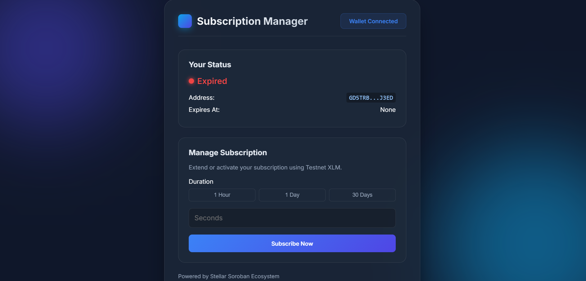
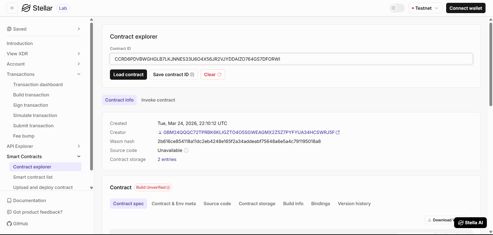

# 🎓 Subscription Manager 🔐

A decentralized subscription system that tracks user access based on time using a Stellar Soroban smart contract. The project includes a sleek, premium frontend web application with demo mode support.

## Deployment Details

*   **Contract ID / Address:** `CCRD6PDVBWGHGLB7LKJNNES33U6O4X56JR2VJYDDAIZO764GS7DFORWI`
*   **Network:** Stellar Testnet
*   **Deployment Link:** `[Insert Deployment URL Here]`

## Dashboard Preview



---

## Stellar Labs



---

## Features ✨

*   **Time-Based Access Control:** Users can subscribe for a specific duration, and the smart contract tracks their access seamlessly on the ledger.
*   **Instant Verification:** Anyone can query a user's subscription status — the contract returns `true` if active, `false` otherwise.
*   **Non-Custodial Wallet Integration:** Securely connect and sign transactions using the [Freighter Browser Extension](https://www.freighter.app/).
*   **Demo Mode:** Supports localStorage-based demo mode for testing without a live wallet.
*   **Tamper-Proof Timestamps:** Subscriptions are securely tied to the Soroban ledger's precise block timestamps.

## Project Architecture 🏗️

The project is divided into two main components:

1.  **Smart Contract (`/contracts/subscription`)**: Written in Rust using the Soroban SDK. It handles subscriptions, access validation, and expiration tracking.
2.  **Frontend (`/frontend`)**: A Web3 frontend (`index.html` + `app.js`) that interacts with the deployed contract on the Soroban Testnet via Freighter wallet.

---

## Getting Started 🚀

### Prerequisites

*   [Node.js](https://nodejs.org/) (v18+)
*   [Rust](https://www.rust-lang.org/) (v1.70+)
*   [Stellar CLI](https://developers.stellar.org/docs/build/smart-contracts/getting-started/setup)
*   [Freighter Wallet Extension](https://www.freighter.app/)

### 1. Smart Contract (Phase A)

The contract is already deployed to the Stellar Testnet at the address above. To deploy it yourself:

1. Build the contract:
   ```bash
   stellar contract build
   ```
   Or manually:
   ```bash
   cargo build --target wasm32-unknown-unknown --release
   ```
   Output: `target/wasm32-unknown-unknown/release/subscription.wasm`

2. Run unit tests:
   ```bash
   cargo test
   ```

3. Deploy to Testnet:
   ```bash
   stellar contract deploy \
     --wasm target/wasm32-unknown-unknown/release/subscription.wasm \
     --source <YOUR_SECRET_KEY> \
     --network testnet
   ```

4. Invoke `subscribe`:
   ```bash
   stellar contract invoke \
     --id CCRD6PDVBWGHGLB7LKJNNES33U6O4X56JR2VJYDDAIZO764GS7DFORWI \
     --source <YOUR_SECRET_KEY> \
     --network testnet \
     -- subscribe --user <YOUR_PUBLIC_KEY> --duration 3600
   ```
   
5. Check if subscription `is_active`:
   ```bash
   stellar contract invoke \
     --id CCRD6PDVBWGHGLB7LKJNNES33U6O4X56JR2VJYDDAIZO764GS7DFORWI \
     --network testnet \
     -- is_active --user <YOUR_PUBLIC_KEY>
   ```

6. Fetch precise `get_expiry` UNIX timestamp:
   ```bash
   stellar contract invoke \
     --id CCRD6PDVBWGHGLB7LKJNNES33U6O4X56JR2VJYDDAIZO764GS7DFORWI \
     --network testnet \
     -- get_expiry --user <YOUR_PUBLIC_KEY>
   ```

### 2. Frontend Application (Phase B)

1. Navigate to the frontend directory:
   ```bash
   cd frontend
   ```
2. Open `index.html` in a browser directly, or serve it locally.
3. Supports **Demo Mode** (localStorage) and **Freighter wallet** for live testnet interaction.

### Connecting your Wallet

1. Install the Freighter extension.
2. Switch the Freighter network to **Testnet**.
3. Fund your Freighter wallet using the [Stellar Laboratory Friendbot](https://laboratory.stellar.org/#account-creator?network=test).
4. Click **CONNECT FREIGHTER** in the top right corner of the dApp.

## Contract API 📋

| Function | Who Can Call | Description |
|---|---|---|
| `subscribe(user, duration)` | Anyone | Subscribes the specified user for `duration` seconds |
| `is_active(user)` | Anyone | Returns `true` if the user's subscription is currently active |
| `get_expiry(user)` | Anyone | Returns the precise UNIX timestamp of expiration |
